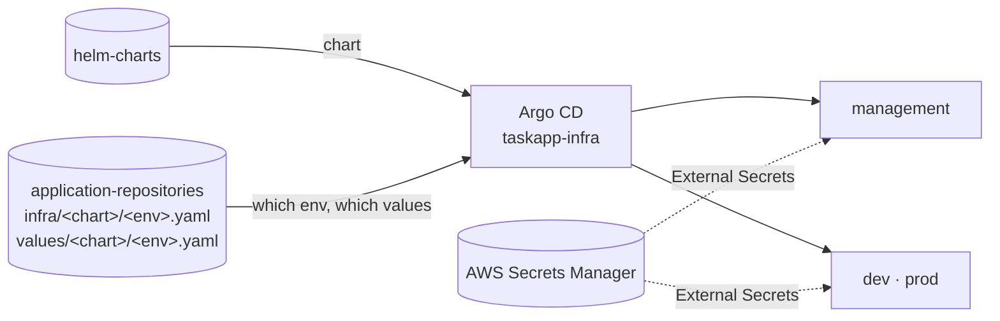

# helm-charts

Helm charts for the platform's own cluster-level pieces: the per-cluster
baseline every environment gets, Crossplane's provider wiring, and a traffic
generator. Service charts aren't here. Each service ships its chart in its own
repository, generated from
[platform-scaffolds](https://github.com/entr0pian/platform-scaffolds).

## Where it fits



Charts are deployed only by the `taskapp-infra` ApplicationSet in
[argocd](https://github.com/entr0pian/argocd). Whether a chart runs in an
environment, at which revision and with which values is decided by its files in
[application-repositories](https://github.com/entr0pian/application-repositories).
One chart serves every environment, and the differences live only in values.

## Charts

| Chart | Runs on | What it does |
|---|---|---|
| `platform` | every cluster | The per-cluster baseline, below |
| `crossplane-provider-config` | management | `ProviderConfig`s for Crossplane's AWS, Kubernetes and GitHub providers, each behind its own toggle |
| `traffic-generator` | per environment | One k6 pod sending synthetic traffic to in-cluster services, so dashboards and the portal show realistic, varying load |

### `platform`

Everything a cluster needs before platform workloads can run, each part
switched on per environment:

| Part | Where | Purpose |
|---|---|---|
| `ClusterSecretStore` | all | External Secrets reads AWS Secrets Manager, authenticating with EKS Pod Identity |
| Registered clusters | management | One Argo CD cluster Secret per workload cluster, built from the endpoint and CA its Terraform publishes. No stored credential: Argo CD authenticates with its own Pod Identity |
| Recording rules | all | `platform:*` series (CPU, memory, limits, restarts, readiness, OOM kills, replicas), labelled `component`/`environment`. Only pods carrying both platform labels appear. Each cluster remote-writes only series with both labels to central Mimir |
| Service Overview dashboard | management | One Grafana dashboard for every component in every environment, selected by `component` and `environment` |
| `LimitRange` | dev, prod | Default requests/limits and a 4× limit-to-request cap in the chart's target namespace (`default`) |
| Backstage read access | dev, prod | A read-only ClusterRole for the portal's Logs and Details views: no Secrets, no ConfigMaps, no exec, no writes |
| `platform` namespace | management | Where every `Component` and its repository resources live. It's never pruned, because deleting it would delete the GitHub repositories |
| Credentials | management | ExternalSecrets for Crossplane's AWS and GitHub credentials and Argo CD's webhook secret |

## Design choices

- **Platform charts here, service charts with the service.** A service's chart
  changes with its code and is pinned to the same commit as its image. The
  platform's baseline changes on a different cadence and belongs to the
  platform.
- **Identity labels as the membership test.** The recording rules join on the
  `platform.taskapp.io/{component,environment}` pod labels instead of filtering
  by namespace or pod name. A workload is part of the platform's view exactly
  when it carries those labels.
- **No secrets in Git.** Every credential is a path in Secrets Manager,
  delivered by External Secrets.

## Legacy

These charts are kept for reference and aren't deployed anywhere:

- `backend`, `frontend`, `backend-operator`, `common`: the original reference
  app and its operator, from before services owned their charts.
- `crossplane-compositions`: the original cluster-scoped SQS composition,
  waiting to be reworked as a namespaced API in
  [crossplane-compositions](https://github.com/entr0pian/crossplane-compositions),
  where the RDS composition already moved.

## Development

```sh
helm lint platform
helm template platform -f <values file>   # render one environment's values
```
